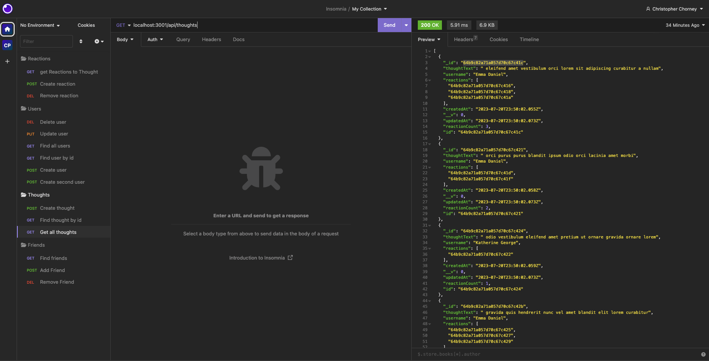
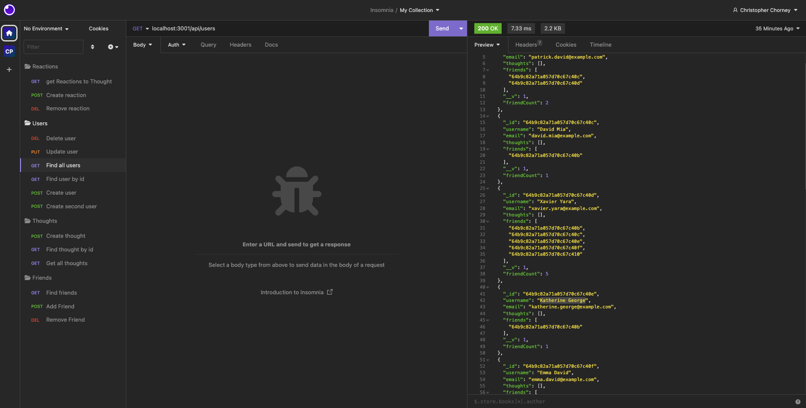

# Social Network API

A NoSQL API for a social network web application that stores users, their thoughts and a friend list.

## Description

- This project is a social network API that uses Express.js routing and MongoDB database. This API is the foundation for a future social network platform and allows the developer to access all relevant information needed to create, update, modify and delete information stored in the database.
- The MongoDB database is scalable and can handle the complexity required by a social media platform. It is flexible, high performance and open source.
- This database and its associated routing allows the developer of the social media platform to quickly and clearly find and update all relevant data. The models used in this database create clear delineation of relationships between objects in the database, and can be quickly implemented in the front end build using API calls.
- The developer learned the importance of careful error handling, console logging data returns from requests and the careful implementation of data structure syntax for MongoDB.

## Table Of Contents

[Installation](#installation)

[Usage](#usage)

[Credits](#credits)

[License](#license)

## Installation

To run this application from the command line:

- first run "npm run seed" to seed the database with custom-made randomized data
- then run "npm start" to start the server on your localhost (PORT 3001).

## Usage

Once the server is up and running, use a route tester such as [Insomnia](https://insomnia.rest/download) to test all relevant GET, PUT, DELETE and POST routes.

## Screenshot / Video

[Link to Demo Video](https://drive.google.com/file/d/1TO7BxUTTXkucWuezP6WhisbwzPCSjaJE/view)

## Contributing

Tutorials used in this project include:
https://www.mongodb.com/try/download/compass

## License

This project is licensed under the MIT license.

## Features

- NoSQL database
- Express.js
- Mongoose

## Tests

none at this time

## Questions

Please direct questions to the owner of this repository at ckc2007@gmail.com

Owner GitHub page:
[ckc2007](https://github.com/ckc2007).

## Credits

This README was created using the README generator app by ckc2007!
visit the GitHub page to try it out:
[README Generator app by ckc2007](https://github.com/ckc2007/README-Generator)
